# Fluxograma do funcionamento do Computador IAS

<!-- <Flowchart> -->

#### Projeto orientado pelo professor [David Alain do Nascimento](https://github.com/davidalain) na disciplina **_Arquitetura de Computadores_**
#### Curso Superior de Tecnologia em **_Análise e Desenvolvimento de Sistemas (ADS)_** 
#### IFPE Campus Garanhuns

#### Diagrama desenvolvido pelos estudantes para cada tipo de instrução:

##### Instruções de transferência de dados
- [José Otávio Gurgel Souto](https://github.com/OTGSJ)
- [Fagner Timoteo da Silva](https://github.com/Othergamer1)
- [João Pedro Bezerra Oliveira](https://github.com/yJPBO)

##### Instruções de desvio condicional, desvio incondicional e modificação de endereço
- [Eliane de Melo Cordeiro](https://github.com/ElianeCordeiro)
- [Flávio Filipe França Farias](https://github.com/trewq010)
- [Maria Eduarda Veloso Cânha](https://github.com/dudacanha)
- [Laura Maria Farias Silva](https://github.com/laura-farias-dev)
- [Wanessa Santana Ferreira](https://github.com/Wanessaa)

##### Instruções aritméticas
- [Helton Jose Carneiro de Lima](https://github.com/heltoncarneiro)
- [Gustavo Osório Bernardo Thompson Flores](https://github.com/gustavobtflores)
- [Joel Rodrigues Viera](https://github.com/joelrodriguesvieira)
- [Ian Pessôa de Miranda](https://github.com/Ian-Pessoa)
- [Enzo Albuquerque Gois](https://github.com/enzo-gois)

```mermaid
---
title:  Fluxograma do funcionamento do Computador IAS (https://github.com/davidalain/ias_computer)
---
flowchart TB

subgraph _fetch_cycle_ [Fetch Cycle]
    START((Start)):::greenClass --> B{"Is next
    instruction 
    in IBR?"}
    B --> |"Yes

    No memory access
    required"| F("IR ← IBR(0:7)
    MAR ← IBR(8:19)")
    F --> I
    B --> |No| C("MAR ← PC")
    C --> D("MBR ← M(MAR)")
    D --> E{"Left
    instruction
    required?"}
    E --> |No| H("IR ← MBR(20:27)
    MAR ← MBR(28:39)")
    E --> |Yes| G("IBR ← MBR(20:39)
    IR ← MBR(0:7)
    MAR ← MBR(8:19)")
    H --> I("PC ← PC + 1
    Reset IBR")
end

subgraph _decode_ [ ]
    I --> DECODE
    G --> DECODE
    DECODE{{"Decode instruction in IR"}}:::orangeClass

    style _decode_ fill:transparent,stroke:transparent

    direction TB
end


subgraph _execution_cycle_ [Execution Cycle]

    %%%%  Instruções de transferência de dados
    %% [José Otávio Gurgel Souto](https://github.com/OTGSJ)
    %% [Fagner Timoteo da Silva](https://github.com/Othergamer1)
    %% [João Pedro Bezerra Oliveira](https://github.com/yJPBO)

    DECODE --->|"LOAD MQ
    Opcode: 00001010"| loadmq_sp

    subgraph loadmq_sp ["LOAD MQ"];
    %%Transfere o valor de MQ para AC
        loadmq01["AC ← MQ"]
        direction TB
    end

    DECODE --->|"LOAD MQ,M(X)
    Opcode: 00001001"| loadmqmx_sp

    subgraph loadmqmx_sp ["LOAD MQ,M(X)"];
    %%Transfere o valor de M(X) para MQ
            loadmqmx01["MBR ← M(MAR)"]
            loadmqmx02["MQ ← MBR"]

            loadmqmx01 --> loadmqmx02
            direction TB
    end

    DECODE --->|"STOR M(X)
    Opcode: 00100001"| stormx_sp

    subgraph stormx_sp ["STOR M(X)"];
    %%Transfere o valor de AC para para M(X)
            stormx01["MBR ← AC"]
            stormx02["M(MAR) ← MBR"]

            stormx01 --> stormx02
            direction TB
    end

    DECODE --->|"LOAD M(X)
    Opcode: 00000001"| loadmx_sp

    subgraph loadmx_sp["LOAD MX"];
    %%Transfere o valor de M(X) para AC
            loadmx01["MBR ← M(MAR)"]
            loadmx02["AC ← MBR"]

            loadmx01 --> loadmx02
            direction TB
    end

    DECODE --->|"LOAD -M(X)
    Opcode: 00000010"| loadminusmx_sp

    subgraph loadminusmx_sp ["LOAD -M(X)"];
    %%Transfere o valor negativo de M(X) para AC 
            loadminusmx01["MBR ← -M(MAR)"]
            loadminusmx02["AC ← MBR"]

            loadminusmx01 --> loadminusmx02
            direction TB
    end

    DECODE --->|"LOAD |M(X)|
    Opcode: 00000011"| loadabsolutemx_sp

    subgraph loadabsolutemx_sp["LOAD |M(X)|"];
    %%Transfere o valor absoluto de M(X) para AC
            loadabsolutemx01["MBR ← |M(MAR)|"]
            loadabsolutemx02["AC ← MBR"]

            loadabsolutemx01 --> loadabsolutemx02
            direction TB
    end

    DECODE --->|"LOAD -|M(X)|
    Opcode: 00000100"| loadminusabsolutemx_sp

    subgraph loadminusabsolutemx_sp["LOAD -|M(X)|"];
    %%Transfere o valor absoluto negativo de M(X) para AC
            loadminusabsolutemx01["MBR ← -|M(MAR)|"]
            loadminusabsolutemx02["AC ← MBR"]

            loadminusabsolutemx01 --> loadminusabsolutemx02
            direction TB
    end

    %%%% Instruções de desvio condicional, desvio incondicional e modificação de endereço
    %% [Eliane de Melo Cordeiro](https://github.com/ElianeCordeiro)
    %% [Flávio Filipe França Farias](https://github.com/trewq010)
    %% [Maria Eduarda Veloso Cânha](https://github.com/dudacanha)
    %% [Laura Maria Farias Silva](https://github.com/laura-farias-dev)
    %% [Wanessa Santana Ferreira](https://github.com/Wanessaa)

    DECODE --> |"STOR M(X, 8:19)
    Opcode: 00010010" | STOR_MXL

    %% A instrução STOR M(X, 8:19) substitui os bits de endereço da instrução esquerda, do bit 28 ao 39, de um local de memória chamado M(X), pelos bits do 28 ao 39 do acumulador (AC). Para isso, o processo passa pelo Registrador de Memória do Barramento (MBR), pois o AC não tem acesso direto à memória. Dessa forma, o conteúdo da memória tem que ser transferido para o MBR, que pode acessar tanto a memória quanto o AC. Então, o MBR substitui os bits do 8 ao 19 pelo conteúdo dos bits do 28 ao 39 do AC. Após a modificação, o conteúdo atualizado é transferido de volta para a memória M(X), finalizando o processo de modificação do campo de endereço da instrução esquerda em M(X).

    subgraph STOR_MXL ["STOR M(X, 8:19)"]
        STOR_MXL1("MBR ← M(MAR)")
        STOR_MXL2("MBR(8:19) ← AC(28:39)")
        STOR_MXL3("M(MAR) ← MBR")

        STOR_MXL1 --> STOR_MXL2
        STOR_MXL2 --> STOR_MXL3
        direction TB
    end


    DECODE --> |"STOR M(X, 28:39)
    Opcode: 00010011"|STOR_MXR 

    %% A instrução STOR M(X, 28:39) substitui os bits de endereço na instrução direita, do bit 28º ao 39º, de um local de memória chamado M(X), pelos respectivos bits do 28º ao 39º do acumulador (AC). Para isso, o processo passa pelo Registrador de Memória do Barramento (MBR), pois o AC não tem acesso direto à memória. Dessa forma, o conteúdo da memória tem que ser transferido para o MBR, que pode acessar tanto a memória quanto o AC.Então, o MBR substitui os bits do 28º ao 39º pelo conteúdo correspondente do AC. Após a modificação, o conteúdo atualizado é transferido de volta para a memória M(X), finalizando o processo de modificação do campo de endereço da instrução direita em M(X).

    subgraph STOR_MXR ["STOR M(X, 28:39)"]
        STOR_MXR1("MBR ← M(MAR)")
        STOR_MXR2("MBR(28:39) ← AC(28:39)")
        STOR_MXR3("M(MAR) ← MBR")

        STOR_MXR1 --> STOR_MXR2
        STOR_MXR2 --> STOR_MXR3
        direction TB
    end


    DECODE --> |"JUMP M(X, 0:19)
    Opcode: 00001101"|JUMP_ML

	%% A instrução JUMP M(X, 0:19), ao receber o endereço de memória (MAR) do ciclo de busca, acessa a palavra de memória que contém duas intruções e armazena esse conteúdo no MBR. O endereço de memória presente na instrução localizada à esquerda desse conteúdo é lido e armazenado no contador de programa (PC). O que indica que o conteúdo apontado por esse endereço será executado no próximo ciclo de busca, independente do conteúdo do registrador IBR ou o que estava armazenado anteriormente em PC.

    subgraph JUMP_ML ["JUMP M(X, 0:19)"]
	    JUMP_MXL1("MBR ← M(MAR)")
        JUMP_MXL2("IBR ← MBR(0:19)")

        JUMP_MXL1 --> JUMP_MXL2

        direction TB
    end


    DECODE --> |"JUMP M(X, 20:39)
    Opcode: 00001110"|JUMP_MR

    %% A instrução JUMP M(X, 20:39),  ao receber o endereço de memória (MAR) do ciclo de busca, acessa a palavra de memória que contém duas intruções e armazena esse conteúdo no MBR. O endereço de memória presente na instrução localizada à direita desse conteúdo é lido e armazenado no contador de programa (PC). O que indica que o conteúdo apontado por esse endereço será executado no próximo ciclo de busca, independente do conteúdo do registrador IBR ou o que estava armazenado anteriormente em PC.

    subgraph JUMP_MR ["JUMP M(X, 20:39)"]
        JUMP_MXR1("MBR ← M(MAR)")
        JUMP_MXR2("IBR ← MBR(20:39)")

        JUMP_MXR1 --> JUMP_MXR2
        direction TB
    end


    DECODE ----> |"JUMP+ M(X, 0:19)
    Opcode: 00001111"|JUMP+_ML

    %% A instrução JUMP+ M(X, 0:19) tem o efeito de saltar para a instrução esquerda da memória apenas se o valor contido no registrador AC for maior ou igual a zero, indicando que AC não é um número negativo. Caso contrário, se o valor em AC for negativo, o fluxo de execução continua normalmente, mantendo os mesmos valores nos registradores.

    subgraph JUMP+_ML ["JUMP+ M(X, 0:19)"]
        JUMP1_MXL1{"AC >= 0"}
        JUMP1_MXL2("MBR ← M(MAR)")
        JUMP1_MXL3("IBR ← MBR(0:19)")
        DO_NOTHING_L("Do nothing")
       
        JUMP1_MXL1 --> |Yes| JUMP1_MXL2
        JUMP1_MXL1 --> |No| DO_NOTHING_L
        JUMP1_MXL2 -->  JUMP1_MXL3
        direction TB
    end


    DECODE ----> |"JUMP+ M(X, 20:39)
    Opcode: 00010000"|JUMP+_MR

    %% A instrução JUMP+ M(X, 20:39) tem o efeito de saltar para a instrução direita da memória apenas se o valor contido no registrador AC for maior ou igual a zero, indicando que AC não é um número negativo. Caso contrário, se o valor em AC for negativo, o fluxo de execução continua normalmente, mantendo os mesmos valores nos registradores.  
      
    subgraph JUMP+_MR ["JUMP+ M(X, 20:39)"]
        JUMP1_MXR1{"AC >= 0"}
        JUMP1_MXR2("MBR ← M(MAR)")
        JUMP1_MXR3("IBR ← MBR(20:39)")
        DO_NOTHING_R("Do nothing")

        JUMP1_MXR1 --> |Yes| JUMP1_MXR2
        JUMP1_MXR1 --> |No| DO_NOTHING_R
        JUMP1_MXR2 -->  JUMP1_MXR3
        direction TB
    end


	%%%% Instruções aritméticas
	%% [Helton Jose Carneiro de Lima] (https://github.com/heltoncarneiro)
	%% [Gustavo Osório Bernardo Thompson Flores](https://github.com/gustavobtflores)
	%% [Joel Rodrigues Viera](https://github.com/joelrodriguesvieira)
	%% [Ian Pessôa de Miranda](https://github.com/Ian-Pessoa)
	%% [Enzo Albuquerque Gois](https://github.com/enzo-gois)
	
	DECODE --> |"ADD M(X)
    Opcode: 00000101"| ADD_MX
    subgraph ADD_MX ["ADD M(X)"]
        %% O conteúdo da memória no endereço indicado pelo MAR é lido e armazenado no MBR %%
        ADD_MX__A("MBR ← M(MAR)")
        %% O conteúdo do MBR é adicionado ao AC, com o resultado sendo armazenado novamente no AC %%
        ADD_MX__B("AC ← AC + MBR")

        ADD_MX__A ---> ADD_MX__B
        direction TB
    end

    DECODE ---> |"ADD M(X)
    Opcode: 00000111"|ADD_MX2
    subgraph ADD_MX2 ["ADD |M(X)|"]
        %% O conteúdo da memória no endereço indicado pelo MAR é lido e armazenado no MBR %%
        ADD_MX2__A("MBR ← M(MAR)")
        %% O bit mais significativo do MBR é setado como 0
        ADD_MX2__B("MBR[0] ← 0")
        %% O conteúdo do MBR é adicionado ao AC, com o resultado sendo armazenado novamente no AC %%
        ADD_MX2__C("AC ← AC + MBR")

        ADD_MX2__A --> ADD_MX2__B
        ADD_MX2__B --> ADD_MX2__C
        direction TB        
    end

    DECODE --> |"SUB M(X)
    Opcode: 00000110"|SUB_MX
    subgraph SUB_MX ["SUB M(X)"]
	    %% O conteúdo da memória no endereço indicado pelo MAR é lido e armazenado no MBR %%
        SUB_MX__A("MBR ← M(MAR)")
	    %% O conteúdo do MBR é subtraido do AC, com o resultado sendo armazenado novamente no AC %%
        SUB_MX__B("AC ← AC - MBR")

        SUB_MX__A ---> SUB_MX__B
        direction TB
    end

    DECODE --> |"SUB |M(X)|
    Opcode: 00001000"|SUB_MX2
    subgraph SUB_MX2 ["SUB |M(X)|"]
	    %% O conteúdo da memória no endereço indicado pelo MAR é lido e armazenado no MBR %%
        SUB_MX2__A("MBR ← M(MAR)")
	    %% O bit mais significativo do MBR é setado como 0
        SUB_MX2__B("MBR[0] ← 0")
	    %% O conteúdo do MBR é subtraido do AC, com o resultado sendo armazenado novamente no AC %%
        SUB_MX2__C("AC ← AC - MBR")

        SUB_MX2__A --> SUB_MX2__B
        SUB_MX2__B --> SUB_MX2__C
        direction TB
    end


    DECODE --> |"MUL M(X)
    Opcode: 00001011"|MUL_MX
    subgraph MUL_MX ["MUL M(X)"]
	    %% O conteúdo da memória no endereço indicado pelo MAR é lido e armazenado no MBR %%
    	MUL_MX_A("MBR ← M(MAR)")
	    %% O conteúdo do MQ é multiplicado com MBR, resultando em um número binario de 80 bits [0:79]%%
	    %% A parte mais significativa [0:39] é armazenada em AC%%
	    %% A parte menos significativa [40:79] é armazenada em MQ%%
    	MUL_MX_B("AC ← (MQ * MBR)[0:39]
    	MQ ← (MQ * MBR)[40:79]")
    	MUL_MX_A ---> MUL_MX_B
        direction TB
    end

    DECODE ---> |"DIV M(X)
    Opcode: 00001100"|DIV_MX
    subgraph DIV_MX ["DIV M(X)"]
	    %% O conteúdo da memória no endereço indicado pelo MAR é lido e armazenado no MBR %%
    	DIV_MX_A("MBR ← M(MAR)")
	    %% O conteúdo do MQ é dividido com MBR%%
	    %% O quociente é armazendo em MQ%%
	    %% O resto é armazenado em AC%%
    	DIV_MX_B("MQ ← AC/MBR
    	AC ← AC%MBR")

        DIV_MX_A ---> DIV_MX_B
        direction TB
    end

    DECODE --> |"LSH
    Opcode: 00010100"|LSH_A
    subgraph LSH_A ["LSH"]
	    %% O conteúdo de AC é deslocado 1 bit para a esquerda e armazenado em AC%%
        LSH("AC ← AC << 1")
    end

    DECODE --> |"RSH
    Opcode: 00010101"|RSH_A
    subgraph RSH_A ["RSH"]
	    %% O conteúdo de AC é deslocado 1 bit para a direita e armazenado em AC%%
        RSH("AC ← AC >> 1")
    end
	
end

subgraph _end_ [End]
    style _end_ fill:transparent,stroke:transparent

    END(("Go back
    to Start")):::greenClass

    loadmq_sp --- END
    loadmqmx_sp --- END
    stormx_sp --- END
    loadmx_sp--- END
    loadminusmx_sp --- END
    loadabsolutemx_sp --- END
    loadminusabsolutemx_sp --- END

    STOR_MXL --- END
    STOR_MXR --- END
    JUMP_ML --- END
    JUMP_MR --- END
    JUMP+_ML --- END
    JUMP+_MR --- END

	ADD_MX --- END
	ADD_MX2 --- END
	SUB_MX --- END
	SUB_MX2 --- END
	MUL_MX --- END
	DIV_MX --- END
	LSH_A --- END
	RSH_A --- END
	
    direction TB
end

classDef greenClass fill:#008000
classDef orangeClass fill:#FF6347
```

