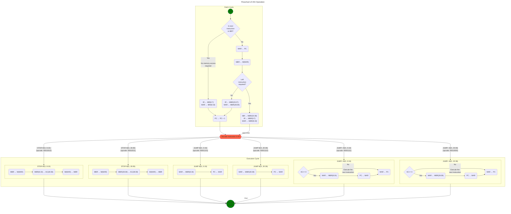

# ias_computer

<!-- <Flowchart> -->

### Fluxograma do funcionamento do Computador IAS

```mermaid
---
title: Flowchart of IAS Operation
---
flowchart TD

subgraph "Fetch Cycle"
    START((Start)):::greenClass --> B{"Is next 
    instruction 
    in IBR?"}
    B --> |"Yes

    No memory access
    required"| F("IR ← IBR(0:7)
    MAR ← IBR(8:19)")
    F --> I
    B --> |No| C("MAR ← PC")
    C --> D("MBR ← M(MAR)")
    D --> E{"Left
    instruction
    required?"}
    E --> |No| H("IR ← MBR(20:27)
    MAR ← MBR(28:39)")
    E --> |Yes| G("IBR ← MBR(20:39)
    IR ← MBR(0:7)
    MAR ← MBR(8:19)")
    H --> I("PC ← PC + 1")
end

subgraph DECODE
	DECODE_A{{"Decode instruction in IR"}}:::orangeClass
    I --> DECODE_A
    G --> DECODE_A
end
style DECODE fill:transparent,stroke:transparent

subgraph "Execution Cycle"

    DECODE_A --> |"STOR M(X, 8:19)
    (opcode: 00010010)" | STOR_MXL
    subgraph STOR_MXL ["STOR M(X, 8:19)"]
            %%      <!-- Essa instrução substitui os bits de endereço da instrução esquerda, do bit 28 ao 39, de um local de memória chamado M(X), pelos bits do 28 ao 39 do acumulador (AC). Para isso, o processo passa pelo Registrador de Memória do Barramento (MBR), pois o AC não tem acesso direto à memória. Dessa forma, o conteúdo da memória tem que ser transferido para o MBR, que pode acessar tanto a memória quanto o AC. Então, o MBR substitui os bits do 8 ao 19 pelo conteúdo dos bits do 28 ao 39 do AC. Após a modificação, o conteúdo atualizado é transferido de volta para a memória M(X), finalizando o processo de modificação do campo de endereço da instrução esquerda em M(X). -->
        STOR_MXL1("MBR ← M(MAR)")
        STOR_MXL2("MBR(8:19) ← AC(28:39)")
        STOR_MXL3("M(MAR) ← MBR")
        STOR_MXL1 --> STOR_MXL2
        STOR_MXL2 --> STOR_MXL3
    end

    DECODE_A --> |"STOR M(X, 28:39)
    (opcode: 00010011)"|STOR_MXR 
    subgraph STOR_MXR ["STOR M(X, 28:39)"]
        %% <!-- Essa instrução substitui os bits de endereço na instrução direita, do bit 28º ao 39º, de um local de memória chamado M(X), pelos respectivos bits do 28º ao 39º do acumulador (AC). Para isso, o processo passa pelo Registrador de Memória do Barramento (MBR), pois o AC não tem acesso direto à memória. Dessa forma, o conteúdo da memória tem que ser transferido para o MBR, que pode acessar tanto a memória quanto o AC.Então, o MBR substitui os bits do 28º ao 39º pelo conteúdo correspondente do AC. Após a modificação, o conteúdo atualizado é transferido de volta para a memória M(X), finalizando o processo de modificação do campo de endereço da instrução direita em M(X). -->
        STOR_MXR1("MBR ← M(MAR)")
        STOR_MXR2("MBR(28:39) ← AC(28:39)")
        STOR_MXR3("M(MAR) ← MBR")
        STOR_MXR1 --> STOR_MXR2
        STOR_MXR2 --> STOR_MXR3
    end

    DECODE_A ---> |"JUMP M(X, 0:19)
    (opcode: 00001101)"|JUMP_ML
    subgraph JUMP_ML ["JUMP M(X, 0:19)"]
%% A instrução "jump" permite que um programa salte para uma nova instrução na memória. Ela acessa uma palavra de memória de 40 bits armazenada em M(X), contendo duas instruções, mas sempre executa a instrução de endereço esquerda. O que significa que esse endereço de memória M(8:19) é copiado para o PC, forçando-o a ser a próxima instrução a ser lida no ciclo de busca.
	JUMP_MXL1("MAR ← MBR(8:19)")
        JUMP_MXL2("PC ← MAR")     
        JUMP_MXL1 ---> JUMP_MXL2
    end

    DECODE_A ---> |"JUMP M(X, 20:39)
    (opcode: 00001110)"|JUMP_MR
    subgraph JUMP_MR ["JUMP M(X, 20:39)"]
%% A instrução "jump" permite que um programa salte para uma nova instrução na memória. Ela acessa uma palavra de memória de 40 bits armazenada em M(X), contendo duas instruções, mas sempre executa a instrução de endereço direita. O que significa que esse endereço de memória M(28:39) é copiado para o PC, forçando-o a ser a próxima instrução a ser lida no ciclo de busca. 
        JUMP_MXR1("MAR ← MBR(28:39)")
        JUMP_MXR2("PC ← MAR")
        JUMP_MXR1 ---> JUMP_MXR2
    end


   DECODE_A ---> |"JUMP+ M(X, 0:19)
    (opcode: 00001111)"|JUMP+_ML
    subgraph JUMP+_ML ["JUMP+ M(X, 0:19)"]
      %% <!-- A instrução JUMP+ M(X, 0:19) tem o efeito de saltar para a instrução esquerda da memória apenas se o valor contido no registrador AC for maior ou igual a zero, indicando que AC não é um número negativo. Caso contrário, se o valor em AC for negativo, o fluxo de execução continua normalmente, seguindo para a instrução subsequente à instrução JUMP+.  -->
        JUMP1_MXL1{"AC>= 0"}
        JUMP1_MXL1 --> |Yes| JUMP1_MXL2("MAR ← MBR(8:19)")
        JUMP1_MXL2 -->  JUMP1_MXL3("PC ← MAR") 
        JUMP1_MXL1 --> |"No 
        
        Execute the 
        next instruction" | JUMP1_MXL4(" MAR ← PC")
        JUMP1_MXL3 --> JUMP1_MXL4
    end

    DECODE_A ---> |"JUMP+ M(X, 20:39)
    (opcode: 00010000)"|JUMP+_MR
    subgraph JUMP+_MR ["JUMP+ M(X, 20:39)"]
   %% <!-- A instrução JUMP+ M(X, 20:39) tem o efeito de saltar para a instrução direita da memória apenas se o valor contido no registrador AC for maior ou igual a zero, indicando que AC não é um número negativo. Caso contrário, se o valor em AC for negativo, o fluxo de execução continua normalmente, seguindo para a instrução subsequente à instrução JUMP+.  -->
        JUMP1_MXR1{"AC>= 0"}
        JUMP1_MXR1 --> |Yes| JUMP1_MXR2("MAR ← MBR(28:39)")
        JUMP1_MXR2 -->  JUMP1_MXR3("PC ← MAR")
        JUMP1_MXR1 --> |"No 
        
        Execute the 
        next instruction" | JUMP1_MXR4(" MAR ← PC")
        JUMP1_MXR3 --> JUMP1_MXR4

    end

end

subgraph END_S ["End"]
    END(("Go back
    to Start")):::greenClass

    STOR_MXL --> END
    STOR_MXR  --> END
    JUMP_ML --> END
    JUMP_MR --> END
    JUMP+_ML ---> END
    JUMP+_MR ---> END
    
end

style END_S fill:transparent,stroke:transparent

classDef greenClass fill:#008000
classDef orangeClass fill:#FF6347


```
